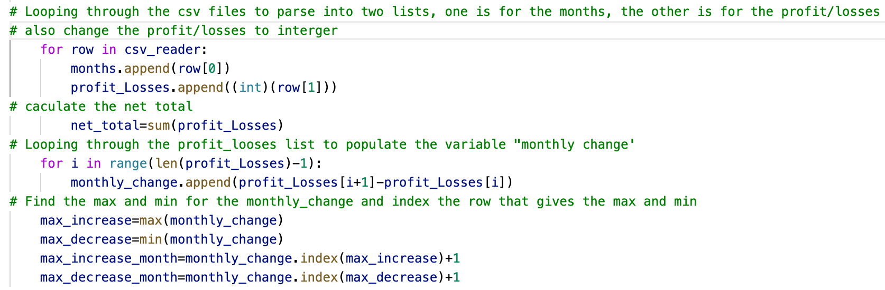
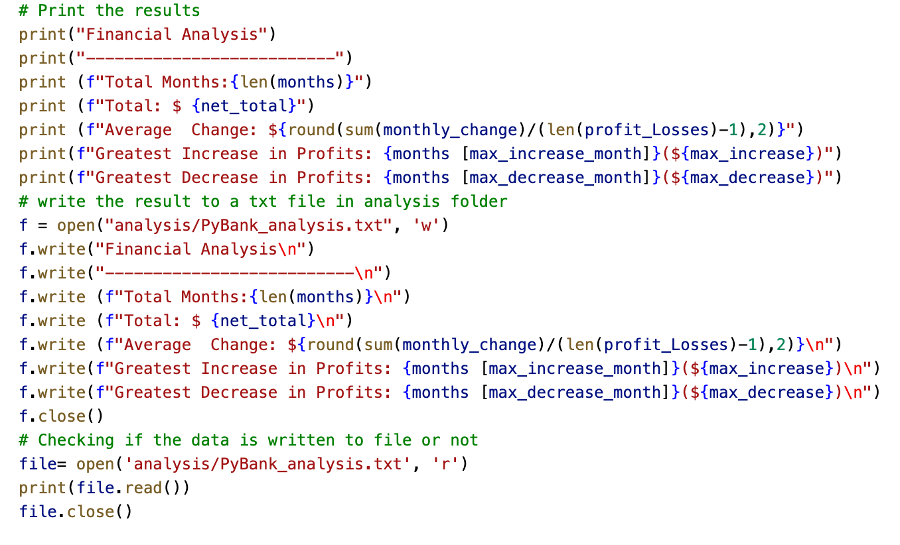
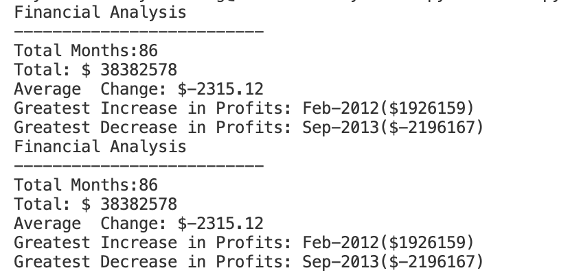
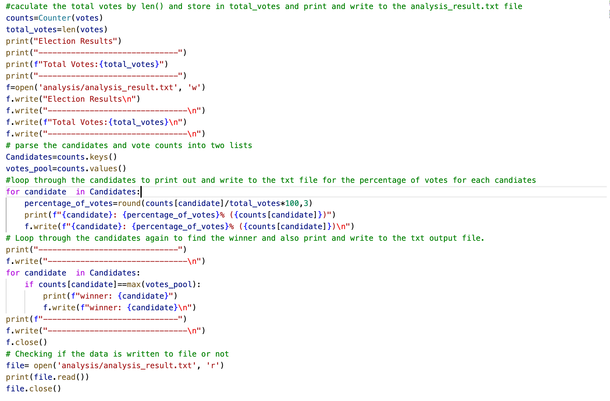
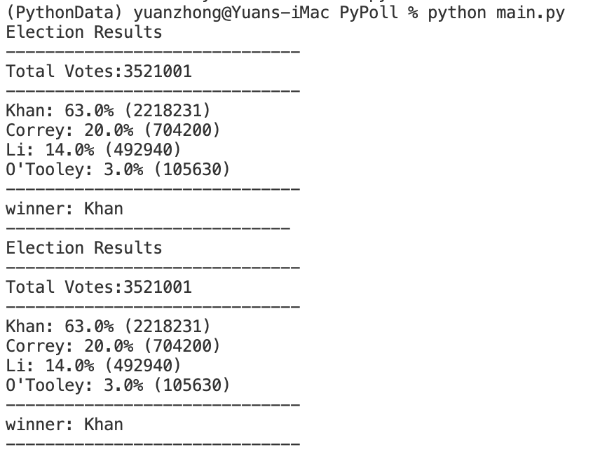

Financial Record analysis 

Lauguage used: Python 

Given a set of financial data called budget_data.csv

Use Python to read in CSV files:

Created a Python script that analyzes the records to calculate each of the following:

The total number of months included in the dataset
The net total amount of "Profit/Losses" over the entire period
The changes in "Profit/Losses" over the entire period and the average of those changes
The greatest increase in profits (date and amount) over the entire period
The greatest decrease in profits (date and amount) over the entire period

Printed the analysis to the terminal and export a text file with the results.

The result

Poll analysis

Lauguage used: Python 

Given a set of poll data called election_data.csv. The dataset is composed of three columns: Voter ID, County, and Candidate.  create a Python script that analyzes the votes and calculates each of the following:

The total number of votes cast
A complete list of candidates who received votes
The percentage of votes each candidate won
The total number of votes each candidate won
The winner of the election based on popular vote.

Printed the analysis to the terminal and export a text file with the results.

