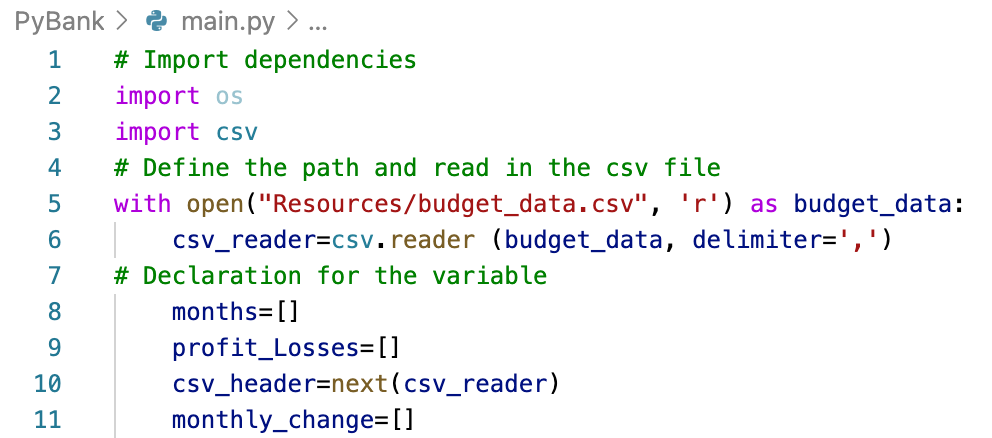

Financial Record analysis 

Lauguage used: Python 

Given a set of financial data called budget_data.csv

Use Python to read in CSV files:

Created a Python script that analyzes the records to calculate each of the following:

  The total number of months included in the dataset
  The net total amount of "Profit/Losses" over the entire period
  The changes in "Profit/Losses" over the entire period and the average of those changes
  The greatest increase in profits (date and amount) over the entire period
  The greatest decrease in profits (date and amount) over the entire period

![analysis.png] (Images/analysis.png)

Printed the analysis to the terminal and export a text file with the results.

![result.png] (Images/result.png)

The result

![final_result.png] (Images/final_result.png)